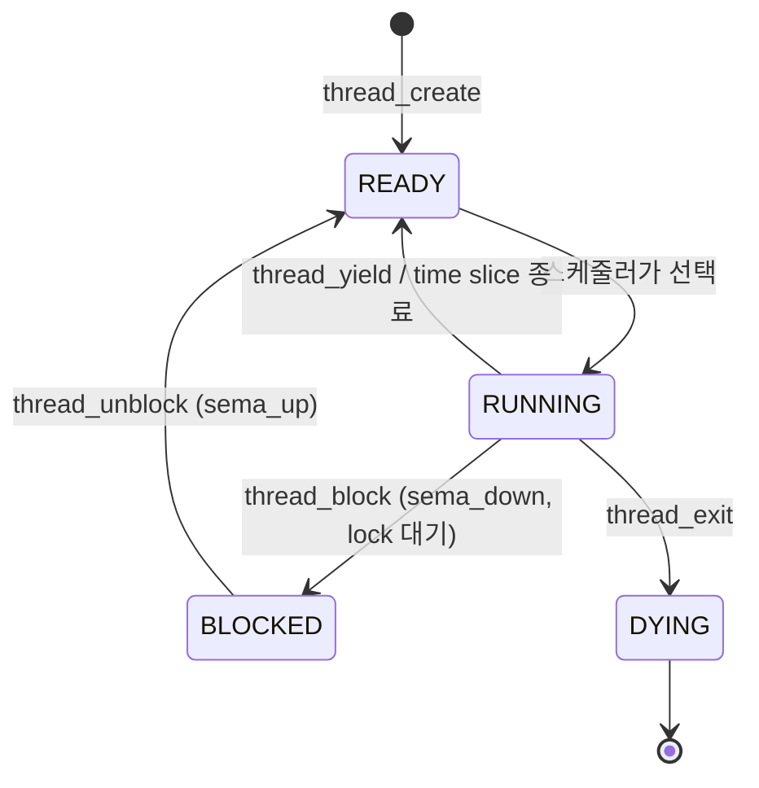

# 🧵 스레드 개념 퀴즈 (2026-10-09)

## 📊 결과 요약

| 문제 | 주제 | 결과 |
|---|---|---|
| [[#Q1. 스레드가 공유하는 것 vs 따로 갖는 것\|Q1]] | 공유 자원 | 🔺 부분 정답 (6개 중 4개) |
| [[#Q2. 컨텍스트 스위치\|Q2]] | 컨텍스트 스위치 | 🔺 절반 정답 |
| [[#Q3. 스레드 상태 전이\|Q3]] | 상태 전이 | 🔺 부분 정답 (4개 중 2개, 상태 설명 없음) |
| [[#Q4. Race condition (`count++`)\|Q4]] | Race condition | ❌ 오답 |

### ❌ 틀린 것 / 모른 것 (복습 우선순위)
- [ ] **PC는 스레드마다 따로** 가진다 (공유한다고 답함) → [[#Q1. 스레드가 공유하는 것 vs 따로 갖는 것|Q1]]
- [ ] **힙은 공유**한다 (따로 갖는다고 답함) → [[#Q1. 스레드가 공유하는 것 vs 따로 갖는 것|Q1]]
- [ ] 스레드 전환이 프로세스 전환보다 싼 이유 = **주소 공간 교체 없음 (TLB flush, 캐시 손실 없음)** (모름) → [[#Q2. 컨텍스트 스위치|Q2]]
- [ ] `thread_yield()`는 **RUNNING → READY** (READY → RUNNING이라고 답함) → [[#Q3. 스레드 상태 전이|Q3]]
- [ ] time slice 종료는 **RUNNING → READY** (DYING이라고 답함) → [[#Q3. 스레드 상태 전이|Q3]]
- [ ] 네 가지 상태의 뜻 설명 (답하지 않음) → [[#Q3. 스레드 상태 전이|Q3]]
- [ ] **READY → BLOCKED 전이는 없다.** 코드를 실행할 수 있는 건 RUNNING뿐이다 (yield가 READY → BLOCKED라고 생각함) → [[#추가 질문 ① yield는 왜 READY → BLOCKED가 아니라 RUNNING → READY인가?|Q3 추가 ①]]
- [ ] **타이머 인터럽트는 "작업 끝" 알림이 아니라 강제로 CPU를 뺏는 주기적 신호**다 (끝났다는 신호로 생각함) → [[#추가 질문 ② 타이머 인터럽트는 "작업이 끝났다"는 신호인가?|Q3 추가 ②]]
- [ ] **전역 변수 `count`는 공유**된다. 스레드마다 1000씩 따로 세는 게 아니다 → [[#Q4. Race condition (`count++`)|Q4]]
- [ ] **`count++`는 CPU에서 읽기 → 더하기 → 쓰기 세 단계**이고, 그 사이에 인터럽트가 끼면 값이 사라진다 (lost update) → [[#Q4. Race condition (`count++`)|Q4]]

### ✅ 맞은 것
- 코드, 데이터는 공유 / 스택, 레지스터는 따로
- 컨텍스트 스위치 때 레지스터를 저장하고 복원한다
- `sema_down()`에서 기다리면 RUNNING → BLOCKED
- `sema_up()`으로 깨어나면 BLOCKED → READY

---

## Q1. 스레드가 공유하는 것 vs 따로 갖는 것

> [!question] 문제
> 같은 프로세스 안의 스레드들은 무엇을 공유하고, 무엇을 각자 따로 가지나요? (코드, 데이터, 힙, 스택, 레지스터, PC)

> [!quote] 내 답
> 공유: 코드, 데이터, PC / 따로: 힙, 스택, 레지스터

| 항목 | 내 답 | 정답 | |
|---|---|---|---|
| 코드 | 공유 | 공유 | ✅ |
| 데이터(전역 변수) | 공유 | 공유 | ✅ |
| 힙 | 따로 | **공유** | ❌ |
| PC | 공유 | **따로** | ❌ |
| 스택 | 따로 | 따로 | ✅ |
| 레지스터 | 따로 | 따로 | ✅ |

> [!success] 정답 핵심
> 스레드마다 따로 갖는 건 **"실행 흐름"에 필요한 것**뿐이다. 바로 **스택 + 레지스터(PC, SP 포함)**.
> 나머지(코드, 데이터, 힙, 열린 파일)는 전부 공유한다.

> [!tip] 기억법
> 같은 책(코드)을 여러 명이 읽어도 **책갈피(PC)는 사람마다** 있다.

### 추가 질문 ① PC도 레지스터인데 왜 따로 이야기하나?
- PC는 레지스터가 맞다. x86-64에서는 `rip`라고 부른다. "레지스터는 따로"면 PC도 따로다.
- 교과서가 따로 쓰는 이유:
  1. **역할이 특별하다.** 범용 레지스터는 계산값을, PC는 "다음에 실행할 명령어 주소"를 담는다. PC가 곧 실행 흐름이다.
  2. **다루는 방법이 다르다.** `mov`로 직접 못 쓰고 `jmp`, `call`, `ret`, 인터럽트로만 바뀐다.
- Pintos `include/threads/interrupt.h`의 `struct intr_frame`:
  ```c
  struct gp_registers R;   // 범용 레지스터
  uintptr_t rip;           // PC
  uintptr_t rsp;           // 스택 포인터
  ```

### 추가 질문 ② 힙은 포인터로 쓰니까 공유되는 건가?
> [!warning] 원인과 결과가 반대
> 공유의 원인은 포인터가 아니라 **같은 주소 공간(같은 페이지 테이블)**이다. 포인터는 접근 수단일 뿐이다.

- 다른 **프로세스**에게 주소 `0x5000`을 넘겨줘도 그 프로세스의 `0x5000`은 자기 메모리다. 페이지 테이블이 다르기 때문이다.
- 🤯 같은 주소 공간이므로 **다른 스레드의 스택도 포인터만 있으면 접근 가능**하다. 스택이 "따로"라는 건 **관례상 따로**이지 **보호받는 따로**가 아니다.

| | 스레드끼리 | 프로세스끼리 |
|---|---|---|
| 주소 공간(페이지 테이블) | **같음** | 다름 |
| 힙/데이터 | 공유 | 분리 (보호됨) |
| 스택 | 영역은 따로, **보호는 안 됨** | 분리 (보호됨) |
| 레지스터(PC, SP 포함) | 진짜로 따로 | 따로 |

---

## Q2. 컨텍스트 스위치

> [!question] 문제
> 컨텍스트 스위치 때 무엇을 저장/복원하나요? 스레드 전환이 프로세스 전환보다 싼 이유는?

> [!quote] 내 답
> 레지스터를 저장 및 복원한다. 두 번째는 모르겠다.

> [!success] 정답
> - **저장/복원:** 레지스터 (범용 레지스터, **PC(`rip`)**, **SP(`rsp`)**, 플래그). SP가 바뀌면 스택이, PC가 바뀌면 실행 위치가 바뀐다.
> - **싼 이유:** 프로세스 전환은 **주소 공간(페이지 테이블)까지 바꿔야** 한다 (x86에서는 `CR3`). 스레드끼리는 주소 공간이 같아서 안 바꾼다.

진짜 비싼 건 페이지 테이블 교체의 **부작용**이다.
1. **TLB flush:** 가상→물리 주소 변환 캐시를 비워야 해서 한동안 느려진다.
2. **Cold cache:** 새 프로세스는 다른 메모리를 써서 CPU 캐시가 쓸모없어진다.

> [!example] Pintos 코드
> - `threads/thread.c`의 `schedule()`: `#ifdef USERPROG` 안에서 `process_activate(next)` 호출 → `userprog/process.c`에서 `pml4_activate(next->pml4)`로 페이지 테이블 교체.
> - Project 1에는 유저 프로세스가 없으니 이 부분이 컴파일되지 않는다. 레지스터 교체만 한다: `thread_launch()`, `do_iret()`.

> [!tip] 한 줄 요약
> 컨텍스트 스위치 = 레지스터 저장/복원 (+ 프로세스면 **주소 공간 교체 → TLB flush, 캐시 손실**)

---

## Q3. 스레드 상태 전이

> [!question] 문제
> `THREAD_RUNNING`, `THREAD_READY`, `THREAD_BLOCKED`, `THREAD_DYING`의 뜻을 설명하고, 아래 상황의 상태 변화를 말해 보세요.
> (a) `thread_yield()` 호출 (b) `sema_down()`에서 기다림 (c) `sema_up()`으로 깨어남 (d) time slice(4 tick) 종료

> [!quote] 내 답
> 상태 설명 없음 / a: ready → running / b: running → blocked / c: blocked → ready / d: dying

### 상태의 뜻
| 상태 | 뜻 | 들어가는 곳 |
|---|---|---|
| `RUNNING` | 지금 CPU에서 실행 중 (CPU당 딱 하나) | — |
| `READY` | **CPU만 주면 바로 실행 가능**, 차례를 기다림 | `ready_list` |
| `BLOCKED` | **어떤 사건을 기다림** (세마포어, 락, sleep 등). CPU를 줘도 못 돈다 | 세마포어의 `waiters` 등 |
| `DYING` | 종료됨, 곧 메모리 해제 | — |

### 상태 전이
| | 상황 | 내 답 | 정답 | |
|---|---|---|---|---|
| a | `thread_yield()` | READY → RUNNING | **RUNNING → READY** | ❌ |
| b | `sema_down()`에서 대기 | RUNNING → BLOCKED | RUNNING → BLOCKED | ✅ |
| c | `sema_up()`으로 깨어남 | BLOCKED → READY | BLOCKED → READY | ✅ |
| d | time slice 종료 | DYING | **RUNNING → READY** | ❌ |

> [!warning] 틀린 이유
> - **(a)** `yield` = "양보하다". **실행 중인 스레드가** 스스로 CPU를 내려놓고 READY로 돌아가는 것이다. 실행 중이어야 함수를 호출할 수 있으니 출발점은 항상 RUNNING이다.
> - **(d)** time slice가 끝난 건 **"네 차례 끝, 줄 뒤로 가"**이지 "죽어"가 아니다. 스레드는 아직 할 일이 남았으니 READY로 간다. DYING은 `thread_exit()`을 불렀을 때뿐이다.
> - **(c) 주의:** 깨어나면 바로 RUNNING이 아니라 **READY**로 간다. (맞힌 부분!)

> [!example] Pintos 코드 (`threads/thread.c`)
> - `thread_tick()`: `if (++thread_ticks >= TIME_SLICE) intr_yield_on_return();` → 인터럽트가 끝날 때 `thread_yield()` 호출
> - `thread_yield()`: `do_schedule(THREAD_READY)` → **RUNNING → READY**
> - `thread_exit()`: `do_schedule(THREAD_DYING)` → **RUNNING → DYING**
> - `thread_block()`: RUNNING → BLOCKED / `thread_unblock()`: BLOCKED → READY



> [!tip] 기억법
> **BLOCKED에서 바로 RUNNING으로 가는 화살표는 없다.** 깨어나도 READY 줄에 먼저 서야 한다.

### 추가 질문 ① yield는 왜 READY → BLOCKED가 아니라 RUNNING → READY인가?
> [!warning] 내가 헷갈린 부분
> "양보하니까 READY에서 BLOCKED로 가야 하지 않나?"라고 생각했다.

- **코드를 실행할 수 있는 건 RUNNING 스레드 하나뿐이다.** READY 스레드는 줄에 서 있을 뿐 아무 코드도 실행하지 못한다. 그래서 `thread_yield()`든 `sema_down()`이든 **함수를 호출한 스레드는 반드시 RUNNING**이다.
- 그래서 **READY → BLOCKED 화살표는 존재하지 않는다.** BLOCKED가 되려면 `sema_down()` 같은 함수를 직접 불러야 하는데, READY 스레드는 함수를 부를 수 없다.
- yield한 스레드는 **기다리는 사건이 없다.** 할 일이 남았고 CPU만 다시 받으면 바로 이어서 할 수 있다. 이게 READY의 정의다.

| | yield (→ READY) | sema_down 대기 (→ BLOCKED) |
|---|---|---|
| 왜 CPU를 놓나 | 남에게 차례를 양보 | 필요한 자원이 없어서 |
| 다시 CPU를 받으면 | 바로 실행 가능 | 아직 못 돈다 (자원이 없으니까) |
| 누가 깨워 주나 | 필요 없음, 스케줄러가 고르면 실행 | 다른 스레드가 `sema_up()` 해 줘야 함 |

> [!tip] 비유: 화장실 줄
> - RUNNING = 화장실 안에 있는 사람
> - READY = 줄 서 있는 사람
> - yield = 볼일이 남았지만 뒷사람에게 양보하고 **다시 줄 맨 뒤로** 감 → READY
> - BLOCKED = 휴지가 없어서 **휴지가 올 때까지** 대기실에 감. 차례가 와도 들어갈 수 없다
> - 줄에 서 있는 사람(READY)은 대기실(BLOCKED)로 갈 이유도 방법도 없다

### 추가 질문 ② 타이머 인터럽트는 "작업이 끝났다"는 신호인가?
> [!warning] 오해
> "READY 쪽에서 RUNNING의 작업이 끝났는지 모르니, 끝났다고 알려 주는 신호가 타이머 인터럽트다"라고 생각했다.

> [!success] 정답
> 타이머 인터럽트는 **작업이 끝났든 말든 일정 시간마다 하드웨어가 무조건 보내는 신호**다. 목적은 **아직 안 끝난 스레드에게서도 CPU를 강제로 빼앗는 것(선점, preemption)**이다.

- **작업이 끝난 경우:** 스레드가 스스로 `thread_exit()`을 불러 DYING이 되고, 그 안에서 다음 스레드를 스케줄한다. 알림이 필요 없다.
- **작업이 안 끝난 경우:** 스레드가 무한 루프를 돌면 영원히 CPU를 안 내놓는다. 그래서 하드웨어 시계가 끼어들어 강제로 뺏는다.
- **READY 스레드는 아무것도 확인하지 못한다.** 실행 중이 아니니까. 확인과 결정은 타이머 인터럽트 핸들러(커널 코드)가 **현재 RUNNING 스레드의 CPU를 빌려서** 한다.

> [!example] Pintos 코드
> - `include/devices/timer.h`: `#define TIMER_FREQ 100` → 1초에 100번 = **10ms마다** 인터럽트
> - `devices/timer.c`의 `timer_interrupt()`: `ticks++; thread_tick();`
> - `threads/thread.c`의 `thread_tick()`: 4 tick(=40ms) 지나면 `intr_yield_on_return()` → 인터럽트가 끝날 때 `thread_yield()` → RUNNING → READY

> [!tip] 비유: PC방 타이머
> 타이머 인터럽트는 "게임 끝났어요?"라고 묻는 게 아니라, **게임 중이든 아니든 40분마다 자리를 바꾸게 하는 알람**이다.

---

## Q4. Race condition (`count++`)

> [!question] 문제
> 전역 변수 `count = 0`. 두 스레드가 동시에 `for (i = 0; i < 1000; i++) count++;`를 실행한다. 끝난 뒤 `count`는 항상 2000인가?

> [!quote] 내 답
> 합이 2000이면 모르겠는데, 아니라면 아니다. 1000, 1000이니까. 힌트의 "세 단계"는 READY - RUNNING - BLOCKED를 뜻하는 것 같다.

> [!failure] 결과: ❌ 오답
> - "1000, 1000"은 스레드마다 `count`를 따로 갖는 것처럼 생각한 답이다. `count`는 **전역 변수 → 데이터 영역 → 공유**된다 (Q1). 두 스레드가 **같은 변수 하나**를 올린다.
> - 힌트의 세 단계는 스레드 상태가 아니라 **`count++`를 CPU가 실행하는 세 단계**였다.

> [!success] 정답
> **항상 2000은 아니다. 2000 이하의 값이 나올 수 있다.** `count++`는 CPU에서 세 개의 명령어로 나뉘고, 그 사이에 타이머 인터럽트가 끼어들 수 있기 때문이다.

```asm
mov  eax, [count]   ; ① 읽기: 메모리 → 레지스터
add  eax, 1         ; ② 더하기: 레지스터 안에서
mov  [count], eax   ; ③ 쓰기: 레지스터 → 메모리
```

| 순서 | 스레드 A | 스레드 B | 메모리 `count` |
|---|---|---|---|
| 1 | ① 읽기: eax = 5 | | 5 |
| 2 | ⏰ 타이머 인터럽트! A의 레지스터(eax=5) 저장 | | 5 |
| 3 | | ① 읽기: eax = 5 | 5 |
| 4 | | ② eax = 6 | 5 |
| 5 | | ③ 쓰기 | **6** |
| 6 | 레지스터 복원 (eax = 5 그대로!) | | 6 |
| 7 | ② eax = 6 | | 6 |
| 8 | ③ 쓰기 | | **6** ← 7이어야 함 |

→ 두 번 더했는데 1만 올랐다. B의 결과를 A가 덮어썼다 (**lost update**).

> [!tip] 앞의 문제들이 전부 연결된다
> - **Q1:** `count`(데이터)는 공유, `eax`(레지스터)는 스레드마다 따로 → A는 옛날 값 5를 자기 레지스터에 들고 있다
> - **Q2:** 컨텍스트 스위치 때 레지스터를 저장/복원 → A의 eax=5가 그대로 돌아온다
> - **Q3:** 타이머 인터럽트는 작업 중간에도 언제든 끼어든다 → ①과 ③ 사이에 끼어들 수 있다

> [!note] 용어
> - **Race condition:** 실행 순서(타이밍)에 따라 결과가 달라지는 상황
> - **Critical section(임계 구역):** 공유 자원에 접근해서 한 번에 한 스레드만 실행해야 하는 코드 구간 (여기서는 `count++`)
> - **해결:** 세 단계를 쪼갤 수 없게(atomic) 만든다 → lock, semaphore, 인터럽트 끄기 (→ Q5)

---

## 📝 아직 안 푼 문제
- [ ] Q4-1. `count = 0`에서 두 스레드가 `count++`를 **한 번씩만** 하면 가능한 결과는?
- [ ] Q5. Semaphore vs Lock vs Condition Variable
- [ ] Q6. `cond_wait()`을 `if`가 아니라 `while`로 감싸는 이유
- [ ] Q7. Alarm Clock: busy waiting 문제와 sleep list
- [ ] Q8. 인터럽트 핸들러에서 잠들면 안 되는 이유
- [ ] Q9. Priority inversion과 priority donation
- [ ] Q10. Nested donation에 필요한 `struct thread` 필드
